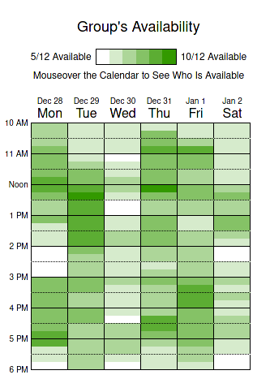
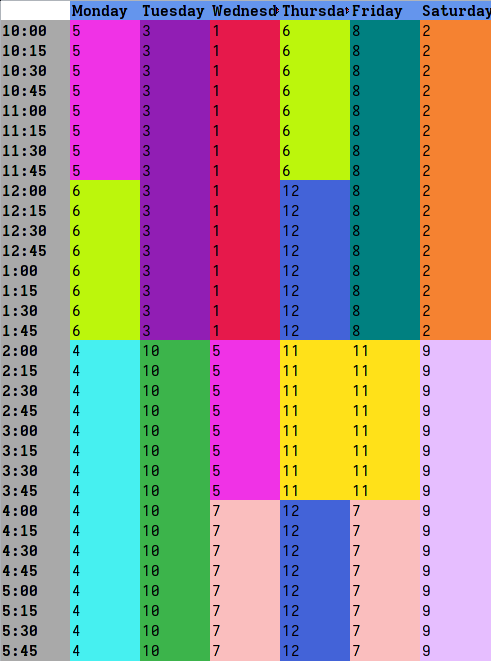

# when2meet scheduler

scrapes a when2meet URL and (assuming it is possible) constructs a non overlapping assignment for each time slot based on who is available at that time.  


## usage info

```text
❯ python scheduler.py --help
usage: scheduler.py [-h] [-l LOWER_BOUND] [-u UPPER_BOUND] [-f [FILTER [FILTER ...]]] [-n NUM] URL

Generate unique schedules from a when2meet instance

positional arguments:
  URL

optional arguments:
  -h, --help            show this help message and exit
  -l LOWER_BOUND, --lower-bound LOWER_BOUND
                        The minimum number of time cells which a person may be assigned (This is a soft constraint and may be broken if it is impossible to satisfy)
  -u UPPER_BOUND, --upper-bound UPPER_BOUND
                        The maximum number of time cells which a person may be assigned (This is a soft constraint and may be broken if it is impossible to satisfy)
  -f [FILTER [FILTER ...]], --filter [FILTER [FILTER ...]]
                        Users which match this list will be filtered out of the data set before scheduling.
  -n NUM, --num NUM     The number of schedules which should be generated.
```
## demo

It will take a when2meet instance like this



and generate arbitrary numbers of valid schedules which fit those constraints

